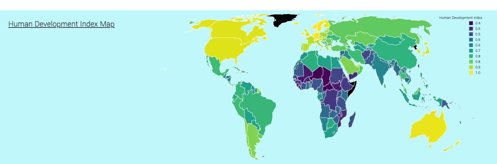

# Tomiko's Final Portfolio

This Final Portfolio was created by Tomiko Karino for the Data 73200 course in the Data Analysis and Visualization program at CUNY Graduate Center in the Fall 2021 semester.

## Final Project
<a href="Project/index.html" target="_blank">Geospatial projections: more than just the coordinates</a>

## Project Plan

### <a href="Project plan/abstract" target="_blank">Abstract</a>
### Sketches
<ul>
  <li><a href="project-sketch.pdf" target="_blank">Early sketch</a></li>
  <li><a href="Project plan/Final project sketch.pdf" target="_blank">Final sketch</a></li>
</ul>

### <a href="Project plan/data-sources" target="_blank">Data sources</a>
